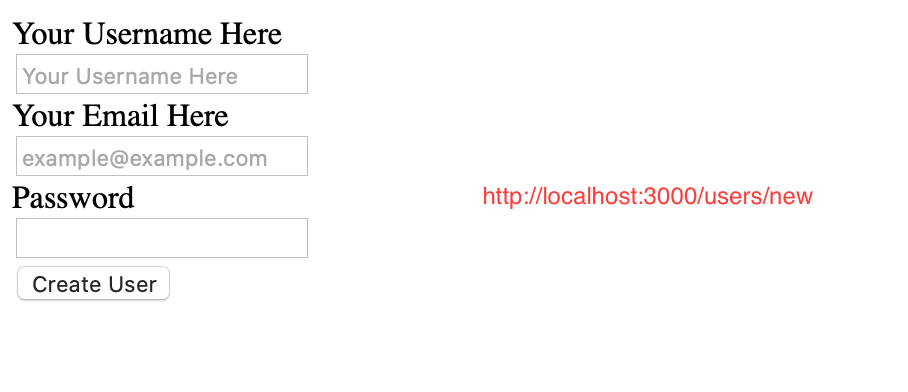
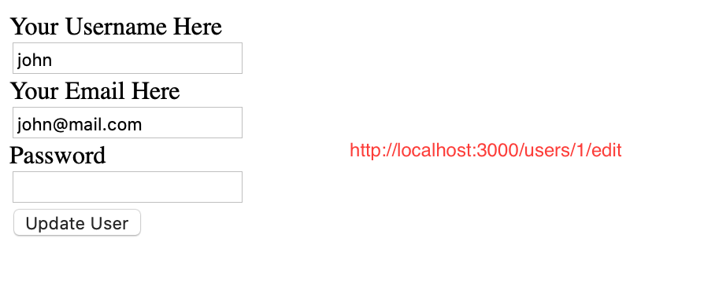

<br />
<p align="center">
  <a href="https://www.microverse.org/">
    
  </a>

  <h2 align="center">Bare Metal Forms and Helpers</h2>

  <p align="center">
    This project is part of the Microverse curriculum in Ruby on Rails module!
  </p>
</p>

## About The Project

These projects will give you a chance to actually build some forms, both using nearly-pure HTML and then graduating to using the helper methods that Rails provides.

<!-- INSTALLATION -->
## Installation

You need to have this app or tools to start using it:
* [Ruby](https://www.ruby-lang.org/en/downloads/)
* [Rails](https://rubyonrails.org/): better to have rails version 2.6.5.
* Clone this repo ```git clone https://github.com/Mindo-Joseph/reddit-micro```
* Open terminal```cd``` to the cloned folder and install gems with ```bundle install```
* After gems install, run migrations ```bin/rake db:migrate```
* Run rails console ```bin/rails console```

### Usage

Once you have started the server, visit the browser at `http://localhost3000/` 

### Create User:




## Edit user:


`

### Built With

* [Ruby](https://www.ruby-lang.org/en/downloads/)
* [Rails](https://rubyonrails.org/):
* [Rubocop](https://github.com/rubocop-hq/rubocop)
* [Stickler](https://stickler-ci.com/)

## Authors

👤 **Edie Atha**

- Github: [@edieatha](https://github.com/edieatha)
- Twitter: [@edieatha](https://twitter.com/edieatha)
- Linkedin: [linkedin](https://www.linkedin.com/in/edieatha/)
 Email: [email](edieatha@gmail.com)

👤 **Joseph Mindo**

- Github: [@MindoJoseph](https://github.com/Mindo-Joseph)
- Twitter: [@mindoJoseph](https://twitter.com/mindoJoseph)
- Linkedin: [Joseph Mindo](https://www.linkedin.com/in/joseph-mindo-367284132/)


## 🤝 Contributing

Contributions, issues and feature requests are welcome!

Feel free to check the [issues page](https://github.com/Mindo-Joseph/reddit-micro/issues).


## Acknowledgments

* [Microverse](https://www.microverse.org/)
* [The Odin Project](https://www.theodinproject.com/)


## 📝 License

This project is [MIT](lic.url) licensed.


## Show your support

Give a ⭐️ if you like this project!

